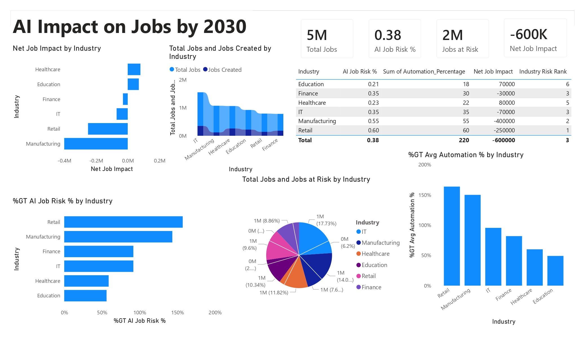

# AI Impact on Jobs by 2030 – Workforce & Automation Analytics

## Project Overview

This Power BI dashboard analyzes the projected impact of Artificial Intelligence and automation on employment across major industries by 2030. It highlights job creation, job displacement, automation risk, and net employment impact to help organizations and policymakers understand future workforce trends.

---

## Dashboard Preview

---

## Objectives

- Analyze industries most affected by AI automation.
- Identify sectors with high job displacement risk.
- Compare job creation versus jobs at risk.
- Measure net employment impact across industries.
- Support workforce planning and reskilling strategies.

---

## Key Metrics

| KPI | Value |
|------|--------|
| Total Jobs | 5 Million |
| AI Job Risk % | 38% |
| Jobs at Risk | 2 Million |
| Net Job Impact | -600,000 |

---

## Dashboard Features

### 1. Net Job Impact by Industry
Shows industries expected to gain or lose jobs due to AI adoption.

**Industries Analyzed**
- IT
- Manufacturing
- Healthcare
- Education
- Retail
- Finance

---

### 2. Total Jobs vs Jobs Created
Compares existing workforce size with projected job creation opportunities across industries.

---

### 3. Industry Risk Assessment
Provides:
- AI Job Risk Percentage
- Automation Percentage
- Net Job Impact
- Industry Risk Ranking

---

### 4. AI Job Risk Analysis
Highlights industries with the highest exposure to automation and workforce disruption.

---

### 5. Jobs at Risk Distribution
Visualizes how job displacement is distributed among industries.

---

### 6. Automation Percentage Comparison
Ranks industries based on projected automation adoption rates.

---

## Key Insights

### High-Risk Industries
- Retail shows the highest AI job risk.
- Manufacturing experiences the largest projected job losses.

### Growth Industries
- Healthcare demonstrates positive net job creation.
- Education remains relatively resilient to automation.

### Workforce Impact
- Approximately 2 million jobs are projected to be affected.
- Overall net employment impact is estimated at -600,000 jobs.

---

## Business Value

This dashboard helps:

- Workforce planners
- HR leaders
- Policy makers
- Economic researchers
- Business executives

make informed decisions regarding workforce transformation and reskilling initiatives.

---

## Tools & Technologies

- Power BI
- DAX
- Power Query
- Excel / CSV Dataset
- Data Modeling
- Data Visualization

---

## Skills Demonstrated

- Power BI Dashboard Development
- KPI Design
- Workforce Analytics
- AI & Automation Impact Analysis
- Data Modeling
- DAX Measures
- Executive Reporting
- Business Intelligence

---

## Author

Yashwanth Katuru

Aspiring Data Analyst | Power BI Developer | Business Intelligence Enthusiast
